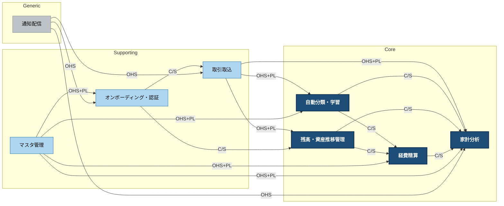

# Context Map（CML 版）

> 生成: 2026-05-01
> ソース: [`07-bounded-contexts.md §4.1`](../07-bounded-contexts.md) を Pattern Selection Guide に基づき再評価
> 出力ファイル:
> - [`context-map.cml`](./context-map.cml) — Context Mapper DSL（真実の源）
> - [`context-map.mmd`](./context-map.mmd) — Mermaid 図
> - 本ファイル — サマリ・根拠・既存 PlantUML との差分

## 1. 何が変わったか（§4.1 → CML）

§4.1 は分析自体に ACL / Conformist / OHS / Shared Kernel が含まれており質は高かった。一方で **多くの内部関係が一律 `Customer-Supplier` で表現** されており、複数 consumer をもつ "実質 OHS" が C/S に丸められていた。本 CML 版では Pattern Selection Guide（複数 consumer + 標準フォーマット → OHS+PL）に従い 5 箇所を昇格させた。

| # | 関係 | §4.1 | CML 版 | 昇格理由 |
|---|---|---|---|---|
| ① | `通知配信 ← (家計分析, 取引取込, オンボーディング)` | OHS×1 + C/S×2 | **全 OHS** | 通知配信は 3 publisher 共通の標準 push サービス。家計分析だけ OHS は不一致 |
| ② | `マスタ管理 → (自動分類, 家計分析, 経費精算, オンボーディング)` | C/S×4 | **OHS+PL** | カテゴリ・経費種別は 4 下流に標準フォーマットで供給。複数 consumer + 標準データ |
| ③ | `取引取込 → (自動分類, 残高, 家計分析)` | C/S×3 | **OHS+PL** | 取引候補・明細取込ジョブは 3 下流に同フォーマットで供給 |
| ④ | `LINE Login (LIFF) → オンボーディング` | ACL のみ | **`[D,ACL]<-[U,OHS,PL]`** | LIFF SDK は公式仕様（PL）を持つ OHS。下流側 ACL を明示 |
| ⑤ | `LINE Messaging API → 通知配信` | Conformist | **`[D,CF]<-[U,OHS,PL]`** | 同様、LINE Messaging API は OHS+PL。下流 CF を明示 |

それ以外（自動分類↔家計分析、残高↔経費精算、経費精算↔家計分析、SMBC, 別銀行/SBI/楽天 など）は §4.1 の評価を踏襲。

## 2. パターン分布

| パターン | 件数 | 内訳 |
|---|---|---|
| Open Host Service + Published Language (U,OHS,PL) | 9 | 取引取込×3, マスタ管理×4, Gmail, AnthropicAPI, LIFF, LINE Messaging API |
| Open Host Service (U,OHS) | 4 | 通知配信×3, AWS Parameter Store |
| Customer-Supplier (U,S ↔ D,C) | 7 | 内部 Core 同士・Onboarding→2 |
| Anti-Corruption Layer (D,ACL) | 8 | Gmail, SMBC, Anthropic, LIFF, 別銀行, SBI, 楽天, AWS PS |
| Conformist (D,CF) | 1 | LINE Messaging API |
| Shared Kernel (SK ↔ SK) | 6 ペア | 共通語彙（取引ID/ユーザーID/金額/費用区分/カテゴリID/経費種別ID 等） |

**合計関係数**: 内部 17 + 外部 9 + SK 6 = 32 本

## 3. 内部のみコンテキストマップ（既存 07a 図との比較用）



## 4. 外部システムを含むフルコンテキストマップ

→ [`context-map.mmd`](./context-map.mmd) を直接レンダリング。Mermaid 対応エディタ（VSCode + Markdown Preview Mermaid Support, GitHub, GitLab 等）で表示可能。

## 5. 関係マトリクス（CML 完全形）

### 5.1 内部関係（17 本）

| Upstream | Downstream | パターン | 受け渡し |
|---|---|---|---|
| 取引取込 | 自動分類・学習 | `[U,OHS,PL] → [D,C]` | 取引候補 |
| 取引取込 | 残高・資産推移管理 | `[U,OHS,PL] → [D,C]` | 残高変動根拠 |
| 取引取込 | 家計分析 | `[U,OHS,PL] → [D,C]` | CSV確定昇格トリガ |
| 自動分類・学習 | 家計分析 | `[U,S] → [D,C]` | 分類済み取引 |
| 自動分類・学習 | 経費精算 | `[U,S] → [D,C]` | 経費種別判定結果 |
| 残高・資産推移管理 | 家計分析 | `[U,S] → [D,C]` | 月次レポート残高推移 |
| 残高・資産推移管理 | 経費精算 | `[U,S] → [D,C]` | 経費精算入金 SMBC 到着 |
| 経費精算 | 家計分析 | `[U,S] → [D,C]` | 不認定分振替 + 最終確定昇格 |
| オンボーディング・認証 | 取引取込 | `[U,S] → [D,C]` | Gmail OAuth + 運用開始日時 |
| オンボーディング・認証 | 残高・資産推移管理 | `[U,S] → [D,C]` | 初期残高入力値 |
| マスタ管理 | 自動分類・学習 | `[U,OHS,PL] → [D,C]` | カテゴリ/経費種別削除リマップ要請 |
| マスタ管理 | 家計分析 | `[U,OHS,PL] → [D,C]` | カテゴリ削除取引移動依頼 |
| マスタ管理 | 経費精算 | `[U,OHS,PL] → [D,C]` | 経費種別 + 月次上限 |
| マスタ管理 | オンボーディング・認証 | `[U,OHS,PL] → [D,C]` | Phase 2-C/D/E 確認 UI |
| 通知配信 | 取引取込 | `[U,OHS] → [D,C]` | PDF/CSV 失敗エラー通知 |
| 通知配信 | 家計分析 | `[U,OHS] → [D,C]` | 月次レポートサマリ送信 |
| 通知配信 | オンボーディング・認証 | `[U,OHS] → [D,C]` | テスト送信 + OAuth 失効通知 |

### 5.2 外部関係（9 本）

| Upstream | Downstream | パターン |
|---|---|---|
| Gmail | 取引取込 | `[U,OHS,PL] → [D,ACL]` |
| SMBC メール | 取引取込 | `[U] → [D,ACL]` |
| Anthropic API | 取引取込 | `[U,OHS,PL] → [D,ACL]` |
| LINE Messaging API | 通知配信 | `[U,OHS,PL] → [D,CF]` |
| LINE Login (LIFF) | オンボーディング・認証 | `[U,OHS,PL] → [D,ACL]` |
| 別銀行貯蓄口座 | 残高・資産推移管理 | `[U] → [D,ACL]` |
| SBI 証券 | 残高・資産推移管理 | `[U] → [D,ACL]` |
| 楽天証券 | 残高・資産推移管理 | `[U] → [D,ACL]` |
| AWS Parameter Store | マスタ管理 | `[U,OHS] → [D,ACL]` |

### 5.3 Shared Kernel（6 ペア）

`取引ID`, `ユーザーID`, `金額`, `費用区分`, `カテゴリID`, `経費種別ID`, `Gmail_message_ID` 等の value object を以下のペア間で共有。

- 取引取込 ↔ 家計分析
- 自動分類・学習 ↔ 家計分析
- 残高・資産推移管理 ↔ 家計分析
- 経費精算 ↔ 家計分析
- 家計分析 ↔ マスタ管理
- 家計分析 ↔ オンボーディング・認証

> 実質的には全コンテキストで共有されるが、CML 上は家計分析を hub とした 6 ペアの明示で代表させた。詳細定義は `08-ubiquitous-language.md §2` を参照。

## 6. 旧版 PlantUML との差分（廃止済み）

旧版 `docs/domain/diagrams/07-context-map.puml`（外部含む全体図）と `07a-context-map-internal.puml`（内部のみ図）は本 CML 版に統合され、2026-05-01 に削除済み。

| 観点 | 旧版 PlantUML | 本 CML 版 |
|---|---|---|
| パターン種別 | C/S 一辺倒（OHS は 1 本のみ） | 6 種（C/S, OHS, OHS+PL, ACL, CF, SK）を使い分け |
| U/D 表記 | 矢印方向のみで暗黙 | `[U]`/`[D]` を文法的に強制 |
| 外部システム | 描画なし（"内部のみ" と明言） | Gmail, SMBC, Anthropic, LIFF, LINE Messaging, 別銀行, SBI, 楽天, AWS PS の 9 件を含める |
| Shared Kernel | 凡例にも無し | 共通語彙を SK で明示（6 ペア） |
| ラベル粒度 | "Phase進捗UI" "リマップ要請" 等の混在 | `implementationTechnology` フィールドに技術手段、データの受け渡しは関係表で集約 |
| レイアウト | hidden エッジで強制（脆い） | 宣言的 CML、レンダリングは Context Mapper / Mermaid に委譲 |
| 凡例 | 色のみ + 外部参照（07-bounded-contexts §4.1） | 関係種別が文法上明示、ファイル単独で読める |

**結論**: 旧 07a の問題は CML への置き換えで構造的に解消された。

## 7. 推奨フォローアップ

`enterprise-architecture:context-mapping` Skill が示した次ステップ:

1. **ADR**: `enterprise-architecture:adr-management` で「② OHS+PL 昇格の判断」を ADR として記録（特に MasterManagement と TransactionImport の責務拡大は将来の境界変更時の参照になる）
2. **アーキテクチャドキュメント**: `enterprise-architecture:architecture-documentation` で C4 Container 図を生成し、本 Context Map と紐付け
3. **Fitness Functions**: `enterprise-architecture:fitness-functions` で「OHS upstream への直接依存逆流の禁止」を ArchUnit / NetArchTest で表現（実装 Phase 4 以降）
4. ~~**既存 PlantUML の扱い**~~: 完了（2026-05-01）。`07-context-map.puml` / `07a-context-map-internal.puml` を削除し、`07-bounded-contexts.md §4.3` の参照を本 CML/Mermaid 版に書き換え済み

## 8. ファイル責任分担

```
docs/domain/architecture/
├── context-map.cml   ← 真実の源（Context Mapper DSL）
├── context-map.mmd   ← Mermaid 図（CML から派生）
└── context-map.md    ← 本ファイル（サマリ・根拠）
```

旧版 `docs/domain/diagrams/07-context-map.puml` および `07a-context-map-internal.puml` は本 CML 版へ統合し、2026-05-01 に削除済み。
