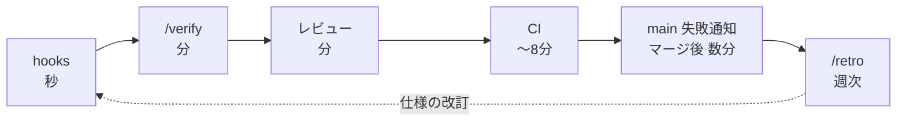

# 工程の通し仕様

要件から `main` への反映までを、フェーズごとに「誰が・何を入力に・何を出力し・何をもって完了とするか」で定義する。**手順の本体は各フェーズの一次資料**にあり、ここには複製しない。

## 1. フェーズ定義

| # | フェーズ | 入力 | 担い手 | 出力 | 完了条件 | 手順の一次資料 |
| --- | --- | --- | --- | --- | --- | --- |
| 1 | 起票 | 要件・不具合・改善案 | 人間 + 対話セッション | GitHub Issue(背景 / 検証可能な受け入れ条件 / 対象コンテキスト / 依存) | 受け入れ条件がチェックボックスで検証可能な形になっている | `.claude/skills/issue-create/SKILL.md`、`.github/ISSUE_TEMPLATE/task.md` |
| 2 | **着手承認** | open Issue | **人間のみ**(`/backlog-ready` は判定補助) | `ready-to-implement` ラベル | 5基準(リポジトリ内で完結 / 受け入れ条件が検証可能 / 依存解決済み / 設計判断なし / 1 PR 粒度)をすべて満たす | `.claude/skills/backlog-ready/SKILL.md` |
| 3 | 着手 | 承認済み Issue | 対話セッション or 無人 Routine | `feat/issue-<番号>-<slug>` ブランチ + `status:in-progress` ラベル | ブランチが最新 `main` から切られ、排他ロックが取れている | `.claude/skills/issue-work/SKILL.md` 手順0-2 |
| 4 | 実装 | Issue の受け入れ条件 + ドメイン資料 | Claude | コード + テスト | 受け入れ条件を満たし、依存の向き(`domain → adapters-postgres → api / web`)に沿っている | `.claude/skills/issue-work/SKILL.md` 手順3 |
| 5 | 検証(内側ループ) | 実装差分 | Claude | 全 green のローカル検証 | `build` / `typecheck` / `test` / `lint` / `format:check`、および条件付きで統合テスト・VRT が green | `.claude/skills/verify/SKILL.md` |
| 6 | レビュー | 実装差分 | レビュー用サブエージェント | 指摘と修正 | `/ddd-review` + 変更パスに応じたレビューを実施し、must-fix を解消(suggestion も原則その場で修正) | `docs/review/README.md` §3、各レビュー skill |
| 7 | 受入シナリオ照合 | 実装差分 | Claude | PR 本文の「受け入れシナリオ(AT)」節 | 該当 AT の特定 / シナリオの追加 / 不要判断 のいずれかを選び、結果を PR 本文に書いた | `.claude/skills/issue-work/SKILL.md` 手順6 |
| 8 | PR・CI(外側ループ) | 検証済みブランチ | Claude + GitHub Actions | open PR + CI 結果 | `Closes #<番号>` のリンクが有効で、`verify` が success | `.claude/skills/issue-work/SKILL.md` 手順7 |
| 9 | **マージ判定** | green な PR | **機械ゲートのみ** | マージ or `needs-decision` | ゲート7条件をすべてコマンド出力で確定できた | `.claude/skills/issue-work/SKILL.md`「マージゲート」 |
| 10 | マージ後確認 | マージ済み `main` | Claude + GitHub Actions | `main` の CI 結果 | `main` の `verify` が green(赤なら以降のマージを止める) | 同上「マージ後の確認」 |
| 11 | 保守 | open な Routine 起点 PR | 無人 Routine | 修復 push・コンフリクト解消・重複検知 | 対象 PR が green か、`needs-decision` で人間に上がっている | `.claude/skills/pr-steward/SKILL.md` |
| 12 | 判断消化 | `needs-decision` の一覧 | 人間 + 対話セッション | 決定の記録・ラベル遷移・docs 反映 | 判断待ちが処理され、Issue が次の状態へ遷移した | `.claude/skills/decide/SKILL.md` |
| 13 | 自己改善 | 運用の失敗データ / docs とコードの乖離 | 無人 Routine | `needs-decision` 付きの改善案 / 乖離報告 Issue | 起票まで(採否の判断は12へ) | `.claude/skills/retro/SKILL.md`、`.claude/skills/docs-drift/SKILL.md` |

フェーズ2と12だけが人間の作業で、他はすべて Claude と GitHub Actions が担う。

## 2. 対話モードと無人モードの差分

`/issue-work` には2つのモードがあるが、**差分は「判断が必要になったときどうするか」の一点に集約されている**。

| 局面 | 対話モード | 無人モード |
| --- | --- | --- |
| 着手する Issue の選定 | 候補を提示してユーザーの了承を得る | `ready-to-implement` の付いた Issue から機械的に選定し、CAS ロックで排他する |
| 受け入れ条件が曖昧 / 設計判断が分かれる | ユーザーに確認して続行 | **実装せず撤退**。元 Issue に判断依頼 + `needs-decision`、次候補へ |
| `/verify` が同一エラーで3回失敗 | ユーザーに報告して停止 | 判断依頼 + `needs-decision` を付けて fire 終了(ブランチは残す) |
| レビュー suggestion の見送り(設計判断を伴うもの) | ユーザーと相談して Issue 化 | `[判断待ち]` Issue を起票して `needs-decision`(別リファクタリング相当の規模による見送りは Issue 化せず PR 本文に記録するのみ) |
| 受入シナリオの正誤が判断できない | ユーザーに確認 | **PR 作成は止めず** `[判断待ち]` Issue に切り出す |
| CI が赤い | 修正 → push を green まで繰り返す | 同じ。ただし同一エラー3回で `needs-decision` を付けて撤退 |
| マージ | 人間が行う(または回収マージに委ねる) | ゲート7条件を満たせば**自分でマージ**する |
| 完了の定義 | PR が green になり、ユーザーに報告した時点 | **PR がマージされ、`main` の CI が green** になった時点 |

無人モードが「確認」の代わりに選ぶのは常に**撤退**であり、推測での続行ではない。撤退は失敗ではなく、判断を人間のキューに載せる正常な出口として設計されている。

## 3. ゲートの階層

変更が `main` に入るまでに通る関門は7層(層0〜6)ある。**人間の関門は層0の1つだけ**で、残りはすべて機械判定。

| 層 | 関門 | 判定者 | 落ちたときの挙動 | 一次資料 |
| --- | --- | --- | --- | --- |
| 0 | **着手承認** | **人間** | 着手されない(バックログに滞留) | [02-labels.md](./02-labels.md) |
| 1 | hooks(実行時ガード) | ローカルの hook | コマンドが実行されない / ターンを終えられない | [03-agent-runtime.md](./03-agent-runtime.md) |
| 2 | `/verify` | Claude | 次工程に進まない。3回失敗で撤退 | `.claude/skills/verify/SKILL.md` |
| 3 | レビュー | サブエージェント | must-fix を解消するまで PR を作らない | `docs/review/README.md` §3 |
| 4 | CI(`verify`) | GitHub Actions | マージ不可。修正 → push を繰り返す | `docs/review/README.md` §4 |
| 5 | **マージゲート**(7条件) | 無人モード | マージせず `needs-decision` で人間へ | `.claude/skills/issue-work/SKILL.md`「マージゲート」 |
| 6 | ブランチ保護(required check) | GitHub | マージが拒否される | `docs/review/README.md` §4「`main` のブランチ保護」 |

層5と層6は同じ `verify` を見ているが、役割が違う。**層5はスキル側の判定、層6は GitHub 側の最後のガード**であり、スキルのゲートが誤って緩んでも層6がマージを拒否する。判定を二重に持っているように見えるが、これは冗長化であって定義の二重化ではない — **ゲート条件の定義そのものは `.claude/skills/issue-work/SKILL.md` の1箇所にしかない**(`/pr-steward` はマージを行わない)。

## 4. 入れ子になったフィードバックループ

同じ失敗でも、**どの層で捕まえるかによってコストが2〜3桁違う**。ワークフローはこの順で網を張っている。



| 層 | 周期 | 捕まえるもの | 捕まえられないもの |
| --- | --- | --- | --- |
| hooks | 秒 | 整形漏れ、規約違反コマンド、型エラー | 振る舞いの誤り |
| `/verify` | 分 | テスト失敗、lint、型、(条件付きで)統合テスト・VRT | 設計の妥当性 |
| レビュー | 分 | 設計判断が要る観点(集約境界・プライバシー・使用性など) | 実行時の失敗 |
| CI | 〜8分 | ローカルで走らせ損ねた検証(特に統合テスト)、`main` と合体した状態 | 既存データがある本番でのみ壊れる変更 |
| `main` 失敗通知 | マージ後 数分 | 意味の上での衝突(semantic conflict) | — |
| `/retro` | 週次 | **繰り返し起きている失敗パターンそのもの** | 単発の失敗 |

最内層の hooks は「CI で落ちるはずのものを、コストがほぼゼロの位置で先に落とす」ための層。整形は `format-after-edit` が編集時に直すため、`format:check` 起因の CI 失敗は原理的に起きない。

最外層の `/retro` だけは性質が違う。**個別の失敗ではなくワークフロー自体の欠陥を捕まえる層**であり、その出力は [04-principles.md](./04-principles.md) の改訂として戻る。

## 5. 無人 fire の構造

無人モードの1 fire は「1 PR = 1 fresh session」を単位とする。前後の fire が残した状態は、着手前の preflight で機械的に回収する。

```
preflight
  ├─ main の健全性チェック(赤ければ何もせず終了)
  ├─ ゴミロックの回収(2条件をコマンド出力で確定)
  ├─ コンフリクトの先解消(Routine 起点の open PR)
  └─ 回収マージ(前の fire が残した green な PR をゲート判定してマージ)
       ↓
WIP 上限チェック(Routine 起点の open PR が5件を超えていたら新規着手しない)
       ↓
候補ループ(最大5件): ロック取得 → 実装 → 検証 → レビュー → PR → CI green → マージ
```

設計上の要点は3つ。詳細と各パラメータは `docs/automation/backlog-routine.md`、手順は `.claude/skills/issue-work/SKILL.md`「無人モード」を正とする。

- **preflight は WIP 上限チェックより前に置く** — 壊れた PR を直し、green な PR をマージして枠を空けてから新規着手を判断する。逆順にすると、上限に達した瞬間に修復もマージも止まって詰まる
- **撤退しても fire は終わらない** — 候補ループの次の Issue へ進む。1件の撤退で fire 全体が空振りするのを防ぐ。ただし**実装コストを既に払った撤退**(`/verify` 行き詰まり・push 前の重複検知)は候補ループに戻らず fire を終える
- **`main` が赤いときは何もしない** — CI は「`main` と合体させた状態」を検証するため、赤い `main` の上に PR を積み増すと以降の全 PR が同じ失敗で赤くなる。バックログは `main` の赤が直るまで意図的に止まる
