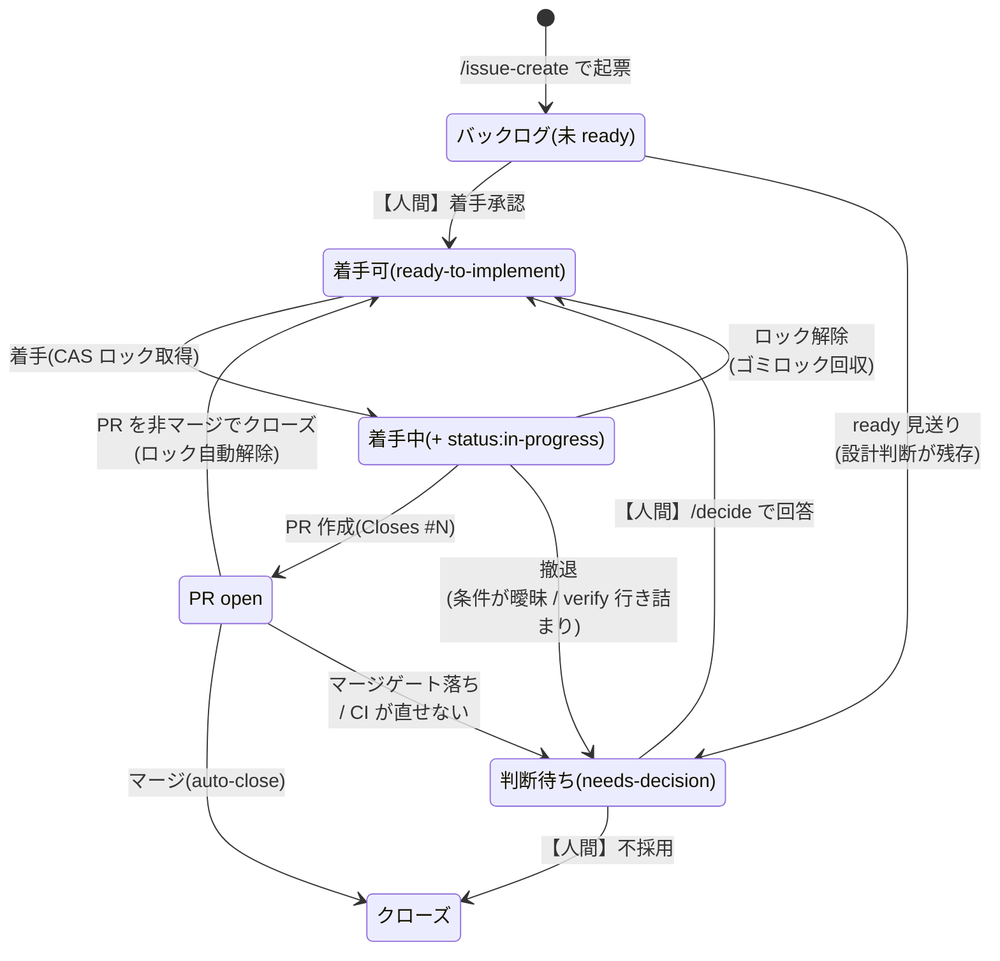

# ラベルの状態遷移

割まるは Issue のラベル3つを**ワークフローの状態機械**として使う。着手してよいか・誰かが着手中か・人間の判断を待っているかは、すべてラベルで表現され、GitHub Actions と無人 Routine はラベルだけを見て動く。本書がその**唯一の定義**。

専用のステータス管理を持たずラベルで済ませているのは、GitHub の検索(`is:issue is:open label:needs-decision`)がそのまま作業キューになり、ラベル付与イベントがそのまま通知トリガーになるため。

## 1. ラベルの定義

| ラベル | 色 | 付ける主体 | 意味 |
| --- | --- | --- | --- |
| `ready-to-implement` | `0E8A16` | **人間** / `/backlog-ready` / `/issue-create` 手順4 | 無人実装してよい(**着手承認**)。依存する先行 Issue が open でも付与でき、その間の着手は Routine の依存チェックが自動で遅延する |
| `status:in-progress` | `FBCA04` | 無人モード / 対話モード | 着手中(fire 間の**排他ロック**)。対話モードの着手宣言と共通 |
| `needs-decision` | `D93F0B` | 無人モード / 人間 / GitHub Actions | **人間の判断待ち**。撤退時の確認・見送り追認・マージゲート落ち・`main` の CI 失敗をすべてここに集約する。Issue に付くと無人モードの対象外になり、**PR に付くとマージゲートが止まる** |

ラベルの初回作成(冪等):

```bash
gh label create "ready-to-implement" --color 0E8A16 --description "無人実装してよい" 2>/dev/null || true
gh label create "status:in-progress" --color FBCA04 --description "着手中" 2>/dev/null || true
gh label create "needs-decision" --color D93F0B --description "人間の判断待ち" 2>/dev/null || true
```

同じ冪等 create コマンドは、ラベル欠落時に無人実行が落ちないよう各 SKILL.md にも**運用ガード**として埋め込まれている(`grep -r "gh label create" .claude/skills` で一覧できる)。埋め込みは定義ではない — 名前・色・説明を変えるときは本書を正とし、全埋め込み箇所を同時に更新する(ずれは `/docs-drift` の突合 D が検知する)。

旧 `needs-clarification` は `needs-decision` に統合済み。残存する旧ラベル付き Issue は `/decide` 手順1a の取り込みスイープが自動で付け替える。

**状態ラベルを増やさない。** 個別 PR の自動マージを止めたいときも専用ラベルは作らず `needs-decision` を使う(マージゲート条件2)。状態が増えるほど、どのラベルの組み合わせが正常なのかを機械判定するコストが上がる。

### 状態機械の外にある補助ラベル

上の3つはワークフローの**状態**を表すラベルで、本書の規律(増やさない・機械判定の対象)はこの状態ラベルについてのもの。状態を表さない補助ラベルは別に存在する:

| ラベル | 色 | 用途 |
| --- | --- | --- |
| `docs-drift` | `C2E0C6` | `/docs-drift` が起票する乖離報告 Issue の識別(重複チェックの検索キー) |
| `priority:high` 等の優先度ラベル | — | 着手候補選定の優先順位付け(`.claude/skills/issue-work/SKILL.md` の候補選定。対話・無人の両モード) |

補助ラベルは状態遷移を変えない(§2〜§3 の遷移の判定は状態ラベルだけで行う)。`priority:*` は候補を選ぶ順序にのみ影響する。

## 2. Issue の状態遷移



`Ready → InProgress → Ready` の戻り経路が2本あるのが要点で、これが**バックログの自己回復**を担う(後述 §5)。

## 3. 遷移の一覧

| # | 遷移 | 主体 | トリガー | 副作用 |
| --- | --- | --- | --- | --- |
| 1 | `+ready-to-implement` | 人間 / `/backlog-ready` / `/issue-create` | 5基準を満たすと判定 | 無人 Routine の候補に入る |
| 2 | `+status:in-progress` | 無人モード / 対話モード | 着手(無人モードは CAS ロックとして取得) | 他の fire がこの Issue を選定しなくなる |
| 3 | `+needs-decision` `-ready-to-implement` `-status:in-progress` | 無人モード | 撤退(条件が曖昧・設計判断・`/verify` 3回失敗・CI が直せない・ゲート落ち) | `notify-judgment-issue` が assign + @メンション → **メール通知**。無人モードの対象外になる |
| 4 | (PR 作成) | 無人モード / 対話モード | `Closes #<番号>` 付きで PR を open | `notify-pr-opened` が assign → **メール通知**(自動マージされる変更を事後に把握する主要導線) |
| 5 | Issue クローズ | GitHub | PR のマージ(`Closes #N` の auto-close) | `status:in-progress` は残ることがあるが実害なし |
| 6 | `-status:in-progress` | GitHub Actions | PR が**マージされずに**クローズ | `unlock-in-progress-on-pr-close` が即時解除。`ready-to-implement` は残るため次の fire が再着手する |
| 7 | `-status:in-progress` | 無人モードの preflight | 「紐づく open PR が無い」かつ「ロックが2時間以上前」を**コマンド出力で確定** | ゴミロックの自己回復(§5) |
| 8 | `-needs-decision` `+ready-to-implement` | **人間**(`/decide`) | 判断依頼への回答 | 無人 Routine の候補に復帰する |
| 9 | `+needs-decision`(新規 Issue) | GitHub Actions | `main` の CI が失敗(`notify-main-failure`) | assign + @メンション → **メール通知**。無人モードは preflight でバックログを止める |
| 10 | `+needs-decision`(新規 Issue) | 無人 Routine | `/retro` の改善案・`/docs-drift` の乖離報告・レビュー見送りの追認 | 同上。タイトル先頭の種別目印で用途を識別する |

遷移3・4・9・10が**メール通知を発生させる経路のすべて**。GitHub は自分自身の操作を通知しないため、github-actions bot(別のアクター)が assign と @メンションを行うことで Participating 通知を成立させている。詳細は `docs/automation/backlog-routine.md`「通知」節。

## 4. PR に付く `needs-decision`

Issue に付く場合と意味が異なるため区別する。

| 付与先 | 効果 | 解除するとどうなるか |
| --- | --- | --- |
| **Issue** | 無人モードの候補選定から外れる(着手されない) | `/decide` で `ready-to-implement` を付け直すと候補に復帰 |
| **PR** | **マージゲートが止まる**(条件2)。CI が green でもマージされない | 次の fire の**回収マージ**が拾ってマージする |

PR 側は「個別 PR の自動マージ停止スイッチ」として設計されている。人間が特定の変更を止めたいときの操作は、ラベルを1つ付けるだけで済む。

## 5. ロックの自己回復

`status:in-progress` は排他ロックなので、fire が異常終了したり PR が非マージでクローズされたりすると**ロックだけが残る**(ゴミロック)。これを放置すると `ready-to-implement` な Issue が全部ロック済みになり、Routine が毎 fire「候補なし」でスキップし続けてバックログが完全に止まる(2026-07-23 に実際に発生)。

回収経路は2本ある。

| 経路 | 担い手 | 対象 | タイミング |
| --- | --- | --- | --- |
| 即時回収 | GitHub Actions(`unlock-in-progress-on-pr-close`) | 人間が PR をレビューで却下(非マージクローズ)したケース | PR クローズ直後 |
| preflight 自己回復 | 無人モードの preflight | PR を作らずに死んだ fire(即時回収の対象外) | 各 fire の着手前 |

いずれも**ロックを外すだけ**で、`ready-to-implement` などの他ラベルには触れない。

preflight の2条件(open PR が無い / 2時間以上経過)は**コマンド出力で機械的に確定させ、自然言語の判断で緩めてはならない**。2026-07-24 の二重着手事故は、ロック付与から10分・open PR ありの状況で条件を無視して回収したことが直接原因だった。判定条件の詳細は `.claude/skills/issue-work/SKILL.md` の preflight 節を正とする。

## 6. 承認ゲートを通らない経路

`ready-to-implement` は**人間の承認**を意味するため、Claude が自分で付けることは原則として禁止されている(無人消化 Routine は `/backlog-ready` を実行しない)。これを崩すと承認ゲートが消える。

例外が1つある。週次の `/docs-drift` Routine は、**docs とコードのどちらが正かが自明で修正が機械的な乖離に限り**、自分が起票した Issue に `ready-to-implement` を付ける。この経路は**起票から `main` への反映まで人間が一度も介在しない**唯一の経路になる。判断が必要な乖離には `needs-decision` を付けて承認ゲートに乗せるため対象は限定されるが、例外であることは意識しておく([04-principles.md](./04-principles.md) の未解決課題にも記載)。
