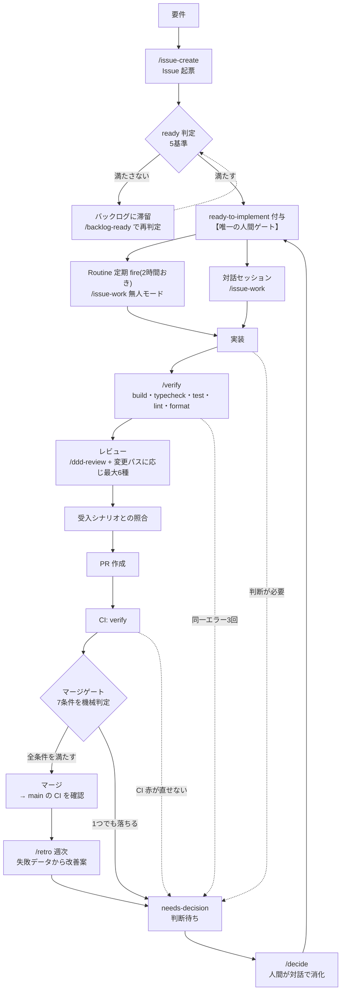

# 開発ワークフロー仕様

割まる(わりまる)の開発は、人間が要件を承認し、Claude Code が実装からマージまでを進める形で回っている。このドキュメント群は、その工程の**全体像と設計原則**を定める一次資料。

目的は2つある。

1. **工程の通し仕様を1箇所に置く** — 手順の本体は 16 の skill に分かれており、レビュー観点・Routine 運用も別資料にある。それらを貫く「どのフェーズで誰が何を決めるか」がどこにも無かった
2. **AI 駆動開発のベストプラクティスを研究・改訂する土台にする** — 「何をしているか」だけでなく **「なぜその形なのか」「どの失敗から来た形なのか」「まだ解けていない問題は何か」** を残す。何をもって良いワークフローとするかの基準と現状評価は [05-criteria.md](./05-criteria.md)、そこから抽出した原則は [04-principles.md](./04-principles.md) にあり、`/retro` と `/decide` の出力をそこへ還元していく

## このドキュメント群の位置づけ

ここに書くのは**全体像・状態遷移・実行基盤の一覧・原則**まで。手順の本体は書かない。

`docs/review/README.md` §1-3 は「同じ観点を2か所で見ない」を定めているが、同じ規律をドキュメントにも適用する。**判定条件・手順・設定値をこのドキュメント群に複製しない**。複製は必ず片方だけが更新されて食い違うため、参照に留める。

| 知りたいこと | 一次資料 |
| --- | --- |
| 工程の全体像・モード差分・ゲートの階層 | [01-lifecycle.md](./01-lifecycle.md) |
| ラベルの状態遷移(誰が付け外しし、何が動くか) | [02-labels.md](./02-labels.md) |
| skill / サブエージェント / hooks / Routine の一覧と責務 | [03-agent-runtime.md](./03-agent-runtime.md) |
| なぜこの形なのか(AI 駆動開発の原則) | [04-principles.md](./04-principles.md) |
| 何をもって良いワークフローとするか(基準と現状評価) | [05-criteria.md](./05-criteria.md) |
| ライフサイクル全体の網羅性(SWEBOK 18 KA との突合) | [06-lifecycle-coverage.md](./06-lifecycle-coverage.md) |
| 各工程の**手順の本体** | `.claude/skills/<スキル名>/SKILL.md` |
| **マージゲートの条件** | `.claude/skills/issue-work/SKILL.md`「マージゲート」(唯一の定義) |
| 軽量設計工程・設計ノートの置き場と命名規約 | `.claude/skills/feature-design/SKILL.md`、[`docs/design-notes/`](../design-notes/) |
| レビュー観点の体系・変更パス → 起動するレビュー・CI の担保範囲・ブランチ保護 | [`docs/review/README.md`](../review/README.md) |
| Routine の運用設定(cron・プロンプト・止め方・トラブル対応) | [`docs/automation/`](../automation/) |
| 受入テストのシナリオと実施規約 | [`docs/acceptance/README.md`](../acceptance/README.md) |
| 外部レビュー・知識体系調査の記録(日付つき) | [`research/`](./research/) |
| ドメイン設計(集約・ユビキタス言語・コンテキスト) | [`docs/domain/`](../domain/) |
| 見た目の規約 / 使用性の規範 | [`DESIGN.md`](../../DESIGN.md) / [`docs/design/usability.md`](../design/usability.md) |

`CLAUDE.md` は Claude が毎セッション読む運用指示であり、本書の要約と索引を兼ねる。詳細を `CLAUDE.md` に書き足さず、本書へのリンクに留める。

## 登場人物

工程を動かす主体は5つ。**それぞれが「できないこと」が仕様の本体**であり、権限の境界がワークフローの安全性を作っている。

| 主体 | 担うもの | できないこと |
| --- | --- | --- |
| **人間**(オーナー1人) | 要件の決定、着手承認(`ready-to-implement` の付与)、判断待ちの消化(`/decide`)、本番受入テストの合否 | — |
| **対話セッション**(Claude Code) | 起票・実装・検証・レビュー・PR 作成。判断に迷ったらユーザーに確認する | `main` への直接 push(hook が実行時にブロック) |
| **無人 Routine**(fire ごとに fresh session) | 承認済み Issue の実装 → PR → CI green → マージ。PR の保守・振り返り・乖離検知 | ユーザーへの確認、承認されていない Issue への着手、ゲートを満たさない PR のマージ |
| **GitHub Actions** | CI(`verify`)、`main` 赤の起票、判断待ちの通知、着手中ロックの自動解除、PR プレビュー配信 | 判断・実装 |
| **hooks**(ローカル実行) | 編集後の自動整形、規約違反コマンドのブロック、ターン終了時の差分 typecheck | リモートの操作 |

無人 Routine が人間の代わりに判断することは**ない**。判断が必要な局面では実装せずに撤退し、`needs-decision` ラベルとして人間に上げる([02-labels.md](./02-labels.md))。

## 全体像

実線が正常系、点線が判断待ちへの離脱。**すべての離脱が `needs-decision` の1点に集まり、`/decide` から `ready-to-implement` に戻る**のがこのワークフローの骨格になっている。

## この仕様の改訂

ワークフローそのものを変えるときは、次の順で反映する。

1. **手順の変更** — 該当の `SKILL.md` を直す。Routine のプロンプトには手順を書かないため、次の fire から自動的に反映される([03-agent-runtime.md](./03-agent-runtime.md))
2. **原則の変更** — [04-principles.md](./04-principles.md) の該当原則に、変更の根拠(どの失敗が起きたか)とともに追記する
3. **観点の追加** — `docs/review/README.md` §5「観点を追加するときの手順」に従う(CI に寄せるかレビュースキルに置くかの切り分けが先)

`/retro`(週次)が無人運用の失敗データから起票する改善案と、`/decide` の決定は、いずれも **04-principles.md の改訂案として扱う**。原則の背後にある根拠が更新されないまま手順だけが変わると、次に同じ判断をするときに理由を再発見できなくなる。
